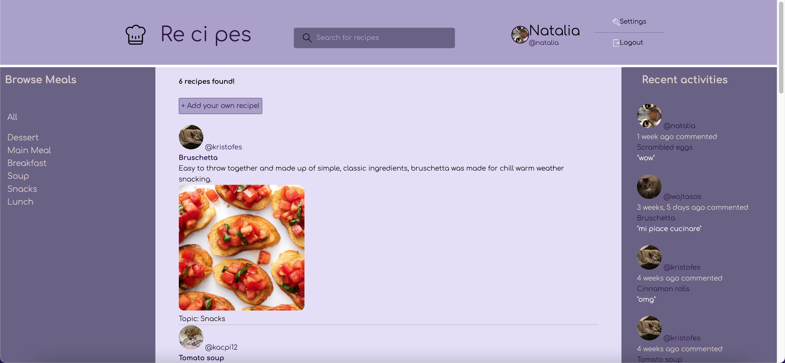
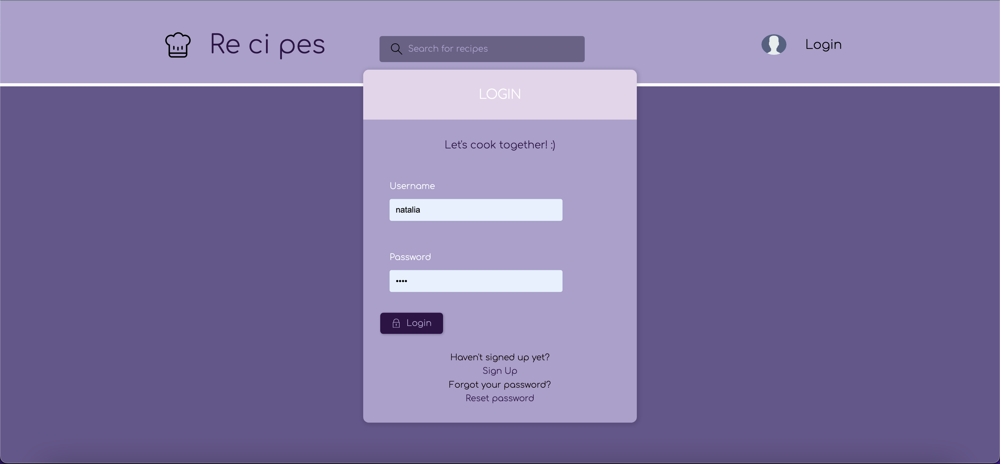
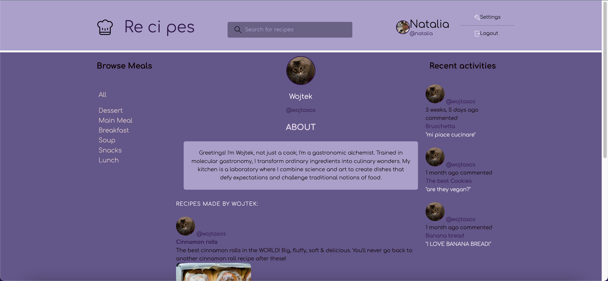

# Re-ci-pes
A Django application that allows for sharing recipes. It enables users to add recipes to the forum and comment on those added by other users.

You can register your account and log in to become an active user.

Then, you can visit other profiles, share your thoughts, or ask questions.

